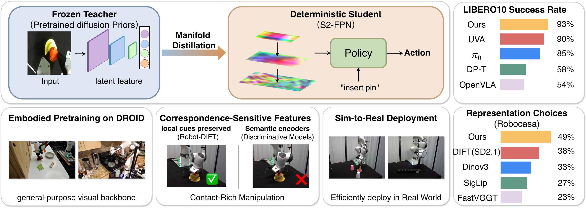

<div align="center">

# Robot-DIFT

### Correspondence-Sensitive Diffusion Features<br>for Contact-Rich Robot Manipulation

Yu Deng · Yufeng Jin · Xiaogang Jia · Jiahong Xue · Gerhard Neumann · Georgia Chalvatzaki

<a href="https://2026.corl.org/"></a>

**Accepted to CoRL 2026**

[](https://arxiv.org/abs/2602.11934)
[](https://drive.google.com/drive/folders/1PHKWcls-hYn8TFP8ovZmwNwqBNiDakg0)
[](LICENSE)

[Quick start](#quick-start) · [Training](#training) · [Evaluation](#evaluation) · [Citation](#citation)

</div>



## Abstract

Robot manipulation often fails in the final millimeters: a policy may recognize the right object yet miss the pose offsets, boundaries, or pre-contact alignments needed for action. We argue that such failures arise when semantic invariance suppresses correspondence cues for closed-loop control, or when these cues are not exposed to the policy in a usable form. Modern visual encoders provide strong semantic abstractions, but contact-rich manipulation requires correspondence sensitivity: discriminative feature responses to action-relevant changes in pose, boundary, and contact geometry. Diffusion features provide a strong prior for dense correspondence, but direct use is impractical due to stochasticity, latency, and representation drift. We introduce Robot-DIFT, a deterministic diffusion-derived backbone for real-time control. Through Manifold Distillation, Robot-DIFT converts a noise-conditioned diffusion Teacher into a clean-input, single-pass Student while preserving the teacher's feature manifold. A Spatial-Semantic Feature Pyramid Network (S2-FPN) fuses coarse-to-fine Student decoder features into visual tokens that expose semantic context and fine contact detail to the policy. Across RoboCasa, LIBERO-10, and real robots, Robot-DIFT outperforms vision-language, self-supervised, geometry-oriented, and diffusion baselines on contact-sensitive tasks. Controlled backbone/readout swaps show that S2-FPN unlocks, rather than replaces, the diffusion correspondence prior.

## Quick start

### 1. Install the encoder dependencies

Use Python 3.10 and a CUDA-compatible PyTorch build. The raw encoder can be used with the inference dependencies alone:

```bash
git clone https://github.com/YuDeng321/Robot-DIFT.git
cd Robot-DIFT
python -m venv .venv
source .venv/bin/activate
python -m pip install torch==2.6.0 torchvision==0.21.0 --index-url https://download.pytorch.org/whl/cu124
python -m pip install -r requirements-inference.txt
```

For DROID training and RoboCasa/LIBERO setup, follow the [installation guide](docs/INSTALLATION.md).

### 2. Extract features from your images

Download the encoder checkpoint from [Google Drive](https://drive.google.com/drive/folders/1PHKWcls-hYn8TFP8ovZmwNwqBNiDakg0) and extract it to a local directory. Provide that directory and a local SD2.1 Diffusers snapshot containing the VAE, tokenizer, and text encoder. Exact model revisions are recorded in [`configs/release/`](configs/release/).

```bash
export ROBOT_DIFT_MODEL_DIR=/path/to/sd2-1-base

python examples/extract_features.py \
  --checkpoint /path/to/robot-dift-encoder \
  --model-repo "$ROBOT_DIFT_MODEL_DIR" \
  --images /path/to/front.png /path/to/wrist.png \
  --prompt "insert the pin" \
  --output outputs/features.pt
```

The example converts images to RGB, resizes to 256 × 256, and processes them with one shared Student. It prints each map's shape and optionally saves CPU tensors. The instruction is shared across the images; omit `--prompt` to use empty text.

### 3. Use the encoder in Python

```python
import torch
from agents.encoders.robot_dift_student_feature_extractor import RobotDIFTStudentFeatureExtractor

encoder = RobotDIFTStudentFeatureExtractor(
    checkpoint_dir="/path/to/robot-dift-encoder",
    model_repo="/path/to/sd2-1-base",
    device="cuda",
)

# RGB float tensors in [0, 1]; prepare your images at the checkpoint's resolution.
images = torch.rand(3, 3, 256, 256)
features = encoder(images, "insert the pin", input_range="zero_one")
print({name: tuple(value.shape) for name, value in features.items()})
```

| Raw map | Channels | Spatial size at 256 × 256 RGB |
| --- | ---: | ---: |
| `us3` | 1280 | 8 × 8 |
| `us6` | 1280 | 16 × 16 |
| `us8` | 640 | 16 × 16 |

Outputs have shape `[batch, channels, height, width]` and dtype `float32`. The API also accepts `input_range="minus_one_one"` (default) and `input_range="uint8"`. It validates the input; resizing belongs to your preprocessing. Deterministic extraction uses checkpoints with VAE latent mode `mode`; legacy `sample` checkpoints retain their recorded behavior.

## Training

### Stage I — DROID encoder adaptation

The original training used **8 GPUs × batch 32 per GPU = global batch 256**, with **no gradient accumulation**. These are the launcher's resource defaults. The training preset implements the paper's stated settings and explicit choices for details the paper leaves open; see the [Stage-I protocol](docs/STAGE1_PROTOCOL.md).

```bash
export WORK=/path/to/work
export ROBOT_DIFT_DATA_ROOT=/path/to/droid-tfds-root
export ROBOT_DIFT_MODEL_DIR=/path/to/sd2-1-base
export ROBOT_DIFT_CLIP_MODEL=/path/to/ViT-B-32.pt
export ROBOT_DIFT_GPUS=8
export ROBOT_DIFT_PER_GPU_BATCH=32
export ROBOT_DIFT_ACCUMULATION_STEPS=1

bash scripts/release/stage1_paper_protocol.sh --dry-run
python scripts/release/check_paper_protocol.py --check-assets
bash scripts/release/stage1_paper_protocol.sh
```

Raw and EMA Student exports are saved under `$WORK/checkpoints/robot_dift_stage1/encoder/checkpoint-<step>[-ema]`. Resume a full training checkpoint with `ROBOT_DIFT_RESUME_FROM=/path/to/model_epoch_<step>.pth`. Resource adaptations, optional ablations, checkpoint selection, and monitoring are documented in the [reproducibility guide](docs/REPRODUCIBILITY.md).

### Stage II — frozen-encoder transfer

Freeze the selected Student, then train the task's S2-FPN/readout and diffusion policy:

```bash
export ROBOT_DIFT_STAGE1_ENCODER=/path/to/robot-dift-encoder
export ROBOT_DIFT_CLIP_MODEL=/path/to/ViT-B-32.pt
export ROBOT_DIFT_ROBOCASA_ROOT=/path/to/robocasa/single_stage

bash scripts/release/stage2_robocasa_paper_protocol.sh --dry-run CoffeePressButton
bash scripts/release/stage2_robocasa_paper_protocol.sh CoffeePressButton
```

This preset uses a 1D U-Net policy, horizons 2/16/8, 100 epochs, and 50 rollouts. The S2-FPN fusion is initialized from Stage I by default; `ROBOT_DIFT_STAGE1_READOUT_SCOPE=full` initializes the full readout. The raw-dense BESO/Mamba control has a separate launcher, [`stage2_robocasa_rawdense.sh`](scripts/release/stage2_robocasa_rawdense.sh). Keep each configuration and checkpoint together when comparing results.

## Evaluation

Evaluate the frozen `us3/us6/us8` interface using correspondence probes, object/contact probes, and downstream task success. Matched comparisons use the same demonstrations, readout, training budget, scene splits, and seeds.

Export and verify an encoder package:

```bash
python scripts/release/export_encoder_release.py \
  --checkpoint /path/to/checkpoint-300000-ema \
  --model-repo "$ROBOT_DIFT_MODEL_DIR" \
  --output /path/to/robot-dift-encoder

python scripts/release/verify_encoder_release.py \
  --package /path/to/robot-dift-encoder \
  --model-repo "$ROBOT_DIFT_MODEL_DIR"
```

See [Reproducibility](docs/REPRODUCIBILITY.md#train-and-compare) for probe commands, artifact contents, and checkpoint comparisons.

## Repository layout

| Directory | Contents |
| --- | --- |
| [`examples/`](examples/) | Image-to-feature quick start |
| [`agents/encoders/`](agents/encoders/) | Shared Student, S2-FPN, and language readouts |
| [`droid_policy_learning/`](droid_policy_learning/) | DROID pretraining and Teacher–Student integration |
| [`configs/`](configs/) | Encoder, policy, dataset, and reproduction settings |
| [`scripts/release/`](scripts/release/) | Training, transfer, export, and verification commands |
| [`scripts/probes/`](scripts/probes/) | Correspondence, object, and contact probes |
| [`docs/`](docs/) | Installation and reproduction details |
| [`tests/`](tests/) | Encoder, training, export, and rollout checks |

Datasets, pretrained models, checkpoints, and experiment outputs are stored outside Git.

## Development checks

```bash
python scripts/release/validate_source_manifest.py
python examples/extract_features.py --help
python -m pip install pytest
PYTHONPATH=.:droid_policy_learning python -m pytest -q \
  tests/test_robot_dift_student_feature_extractor.py \
  tests/test_robot_dift_feature_example.py \
  tests/test_release_metadata_privacy.py
```

GitHub Actions runs these CPU checks with small model stand-ins. Full training tests require the [training environment](docs/INSTALLATION.md). The protocol checker validates configuration values; transfer performance is measured separately.

## Citation

```bibtex
@inproceedings{deng2026robotdift,
  title={Robot-DIFT: Correspondence-Sensitive Diffusion Features for Contact-Rich Robot Manipulation},
  author={Deng, Yu and Jin, Yufeng and Jia, Xiaogang and Xue, Jiahong and Neumann, Gerhard and Chalvatzaki, Georgia},
  booktitle={Conference on Robot Learning},
  year={2026},
  url={https://arxiv.org/abs/2602.11934}
}
```

## Acknowledgements and license

Robot-DIFT builds on [Stable Diffusion 2.1](https://huggingface.co/sd2-community/stable-diffusion-2-1-base), [DIFT](https://diffusionfeatures.github.io/), [CleanDIFT](https://github.com/CompVis/cleandift), [DROID](https://droid-dataset.github.io/), [robomimic](https://robomimic.github.io/), [RoboCasa](https://robocasa.ai/), and [LIBERO](https://lifelong-robot-learning.github.io/LIBERO/).

Robot-DIFT's original code is licensed under [MIT](LICENSE). Bundled upstream code and external model assets retain their respective terms; see [third-party notices](THIRD_PARTY_NOTICES.md).
